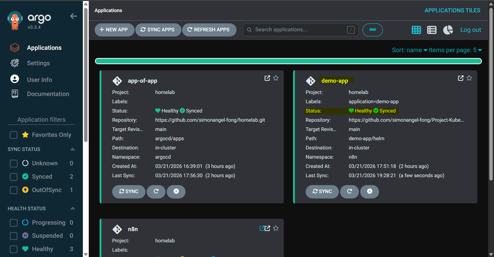
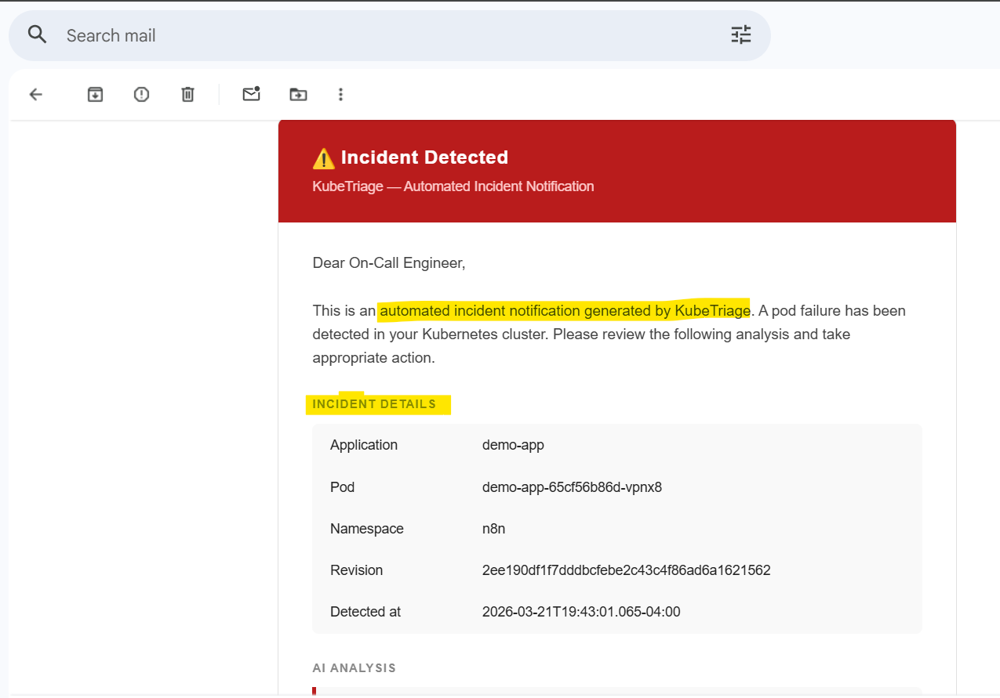

# Project KubeTriage

- [Project KubeTriage](#project-kubetriage)
  - [`n8n` Workflow](#n8n-workflow)
  - [How it works?](#how-it-works)
    - [T0: Healthy Deployment](#t0-healthy-deployment)
    - [T1: Sync for update](#t1-sync-for-update)
    - [T2: Degraded Deployment and Triage Notification](#t2-degraded-deployment-and-triage-notification)
    - [T3: Bugfix](#t3-bugfix)

---

## `n8n` Workflow

[Creating kubetriage n8n workflow](./n8n/README.md)

---

## How it works?

### T0: Healthy Deployment

- Application runs healthly

---

### T1: Sync for update

- New version(with bug) commit and push to repo
- Sync app

---

### T2: Degraded Deployment and Triage Notification

- Application get degraded

- n8n workflow get triggered to create a summary report.

- The summary report is sent.

---

### T3: Bugfix

- Confirm

- [Rollback and Sync Action](./docs/cli.md)
